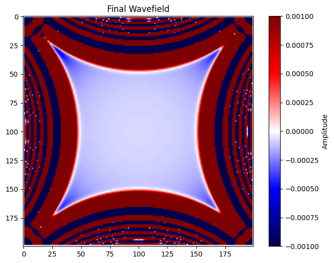

# EQ-Wave
# Earthquake Wave Propagation Simulation (2D FDTD)

This project simulates 2D seismic wave propagation using the **Finite Difference Time Domain (FDTD)** method — a high-level numerical method used in computational geophysics. The simulation includes:

- Ricker wavelet seismic source
- Propagation of compressional (P) waves in a homogeneous medium
- Realistic seismogram outputs from virtual receivers
- Animation of wave propagation

Seismic wave propagation is governed by the 2D scalar wave equation:

$$
\\frac{\\partial^2 u}{\\partial t^2} = c^2 \\left(\\frac{\\partial^2 u}{\\partial x^2} + \\frac{\\partial^2 u}{\\partial y^2}\\right)
$$

We use a second-order finite-difference approximation to numerically evolve this wavefield over time.

## Outputs

### 🔹 Final Wave Snapshot



### 🔹 Wave Propagation Animation


### 🔹 Recorded Seismograms

Three virtual receivers placed at various grid points to record motion.

## How to Run

1. Clone this repository:
```bash
git clone https://github.com/manojaryalgit/EQ-Wave.git
cd EQ-Wave
